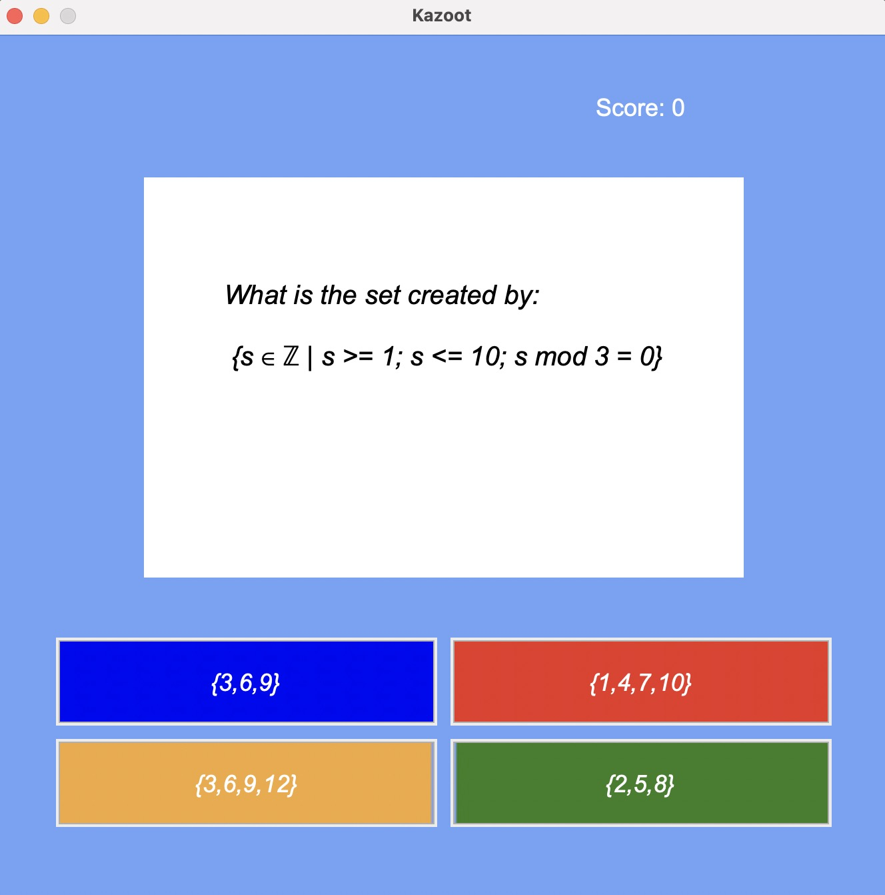

# Kazoot
Kazoot is of course inspired by Kahoot! I am using the app to revise CS fundamental topics which I'm currently studying for, decided it would be more fun to create a flash card/quiz style app and test memory this way 😅

</img>
## Installation Guide

### System Requirements

To star the Kazoot program, since its an application built on Python. It is a requirement that **Python 3** is installed on your computer.

You can check which version of python is installed or if you have it installed at all by:

#### Checking version of Python in the Terminal / shell

1. Depending on your operating systems, there are different way to open the terminal/shell:

- For Macintosh `CMD + space` to open spotlight, then simply type in ***terminal***
- For Windows `Windows key + x` then select ***command prompt***. Followed by typing `bash` in the command prompt.

For both operating systems, type:

```shell
python --version
```

If you don't have Python 3 already installed, please follow visit this [*website*](https://realpython.com/installing-python/) for steps on installing Python 3 to your device and operating system of choice.

Please make sure have **Python 3.11+** version installed.

Operating System requirements to run Python:

- Windows 7,10 or 11
- Mac OS X 10.11 or higher, 64-bit
- Linux: RHEL 6/7, 64-bit (almost all libraries also work in Ubuntu)
    - x86 64-bit CPU (Intel / AMD architecture)
    - 4 GB RAM
    - 5 GB free disk space

### Installation steps

1. Once terminal/shell is open and Python is installed, you can check where you are currently by typing:

```shell
pwd
```

Next, decide where you want the application folder downloaded (like your Desktop or downloads folder for example) like so:

```shell
cd /Users/username/Desktop
cd /Users/username/Downloads
```

2. After that, you need to clone the [Github Repo](https://github.com/jordansbenjamin/Kazoot_PyProject), simply copy and paste this command to your terminal:

```sehll
git clone https://github.com/jordansbenjamin/Kazoot_PyProject.git
```

3. Next, you need to go to the **src** folder location, type this command on the terminal:

```shell
cd Kazoot_PyProject/src
```

4. After that, type these two commands ***separately*** to allow permission for executing the Kazoot program:

```shell
chmod +x setup_kazoot.sh
```

```shell
chmod +x run_kazoot.sh
```

5. To get you set up before running the Kazoot game program, you need to install some requirements and dependencies:

```shell
./setup_kazoot.sh
```

6. After all the necessary requirements are installed, you can now run the program:

```shell
./run_kazoot.sh
```

Add a note here that for the best possible experience, the terminal window needs to be larger than usual.

7. Enjoy the game! It's important to note when you quit the game, all you need to do to play again is to run the game with the command above. As a reminder: `./run_kazoot.sh`

### Dependencies

The requirements to start the Kazoot program have the following dependencies, all automatically installed into the virtual envrionment when you follow the steps above:

```txt
Pillow==10.0.0
```